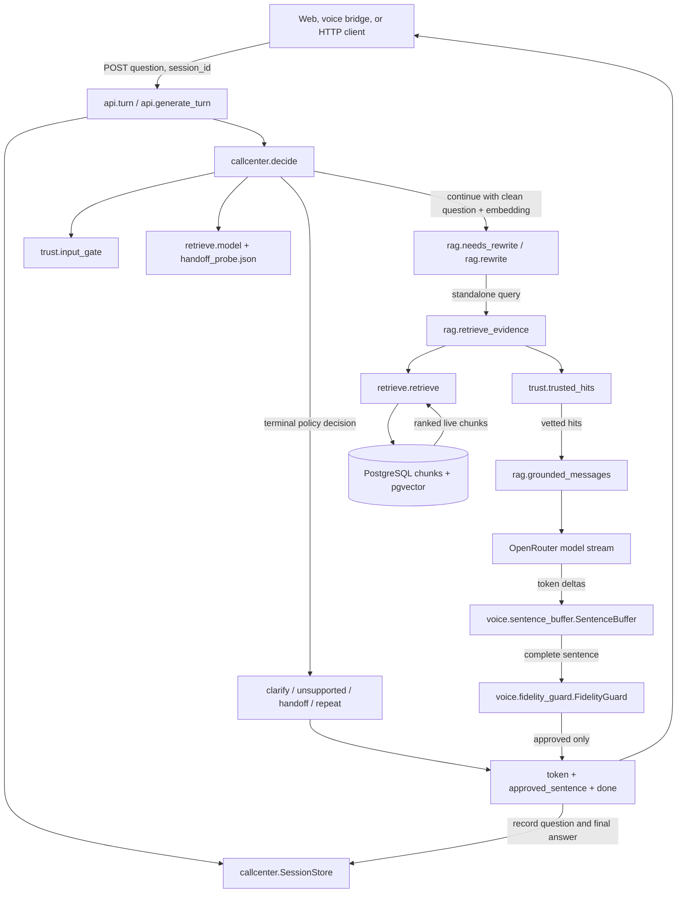
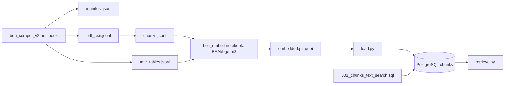
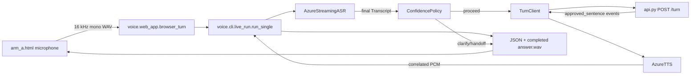
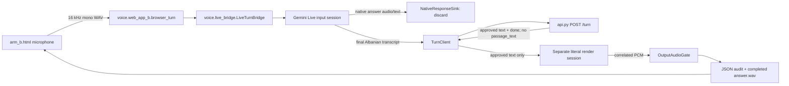

# BoABot project architecture and information flow

This document maps the current checkout. It separates code that serves real
requests from corpus-build tooling, reusable voice architecture, tests, and
generated evidence. `api.py:app` is the only business-answer authority; neither
voice arm generates banking answers independently.

## 1. Repository organization

```text
BoABot/
├── Text/RAG serving path
│   ├── api.py                 FastAPI app, `/turn` SSE orchestration and web UI
│   ├── callcenter.py          pre-retrieval policy, handoff classifier, sessions
│   ├── rag.py                 query rewrite, evidence selection, model prompts
│   ├── retrieve.py            embedding model, PostgreSQL pool, vector/lexical search
│   └── trust.py               input and retrieved-evidence gates
│
├── Corpus and database
│   ├── boa_scraper_v2 (2).ipynb  crawl, extract, normalize and chunk source data
│   ├── boa_embed.ipynb        embed regulation/rate chunks with BAAI/bge-m3
│   ├── manifest.jsonl         crawl provenance
│   ├── pdf_text.jsonl         extracted PDF text
│   ├── chunks.jsonl           regulation chunks (`reg_*`)
│   ├── rate_tables.jsonl      comparative-rate chunks (`rate_*`)
│   ├── embedded.parquet       combined metadata and 1024-dimension vectors
│   ├── load.py                destructive Parquet-to-pgvector loader
│   ├── inspect_parquet.py     read-only artifact sanity check
│   ├── fix_rates.py           rate-label maintenance script
│   └── db/
│       ├── docker-compose.yml local PostgreSQL/pgvector service
│       └── migrations/001_chunks_text_search.sql
│                              optional generated tsvector + GIN index
│
├── Voice package
│   ├── web_app.py / arm_a.html       local Arm A browser harness
│   ├── web_app_b.py / arm_b.html     local Arm B browser harness
│   ├── live_bridge.py                real two-session Gemini Live Arm B bridge
│   ├── schema1.py                    reusable modular ASR -> `/turn` -> TTS design
│   ├── schema2.py                    reusable constrained-Live design and gates
│   ├── turn_client.py                validated async client for `/turn` SSE
│   ├── events.py                     typed transcript/turn/render/audio contracts
│   ├── fidelity_guard.py             value, unit, label and entity verification
│   ├── sentence_buffer.py            token-to-complete-sentence boundary
│   ├── correlation.py / barge_in.py  stale-output and interruption control
│   ├── vad.py / telephony.py         endpointing and call-control interfaces
│   ├── metrics.py / config.py        telemetry and environment configuration
│   ├── phrases.py                    corpus-derived ASR phrase hints
│   ├── confidence_via_retrieval.py   experimental N-best/entity retrieval checks
│   ├── asr/                          Azure, Chirp, fake and abstract ASR adapters
│   ├── tts/                          Azure, fake, SSML and abstract TTS adapters
│   ├── cli/                          live runners, demos, probes and calibration
│   └── tests/                        offline contract and trust-invariant tests
│
├── Evaluation and benchmarking
│   ├── eval.py / validate_eval.py / make_eval.py
│   │                          retrieval scoring, fixture validation/generation
│   ├── eval_calls.py / eval_handoff.py / eval_asr_noise.py
│   │                          policy, classifier and noisy-input evaluation
│   ├── rate_rule_gap.py / measure_hybrid_retrieval.py
│   │                          retrieval/gate diagnostics
│   ├── bench_turn.py / bench_provider.py
│   │                          end-to-end and provider latency benchmarks
│   ├── phase3_*.py            quality experiment, analysis and report building
│   ├── audit_temporal.py / split_markers.py / _audit_*.py
│   │                          targeted audit utilities
│   └── eval_*.jsonl, handoff_*.json, calibration.json
│                              fixtures and frozen classifier/calibration data
│
└── Documentation and generated results
    ├── README.md / EXPLAINED.md / FUNCTIONS.md / PERFORMANCE.md
    ├── VOICE_PIPELINE_SCHEMAS.md / voice/README.md
    ├── *_REPORT*.md / *_ISSUES.md / *_ANSWER.md
    ├── latency_evidence/       saved benchmark inputs, outputs and reports
    └── *.wav / *_results.json  local voice/audit artifacts
```

Files named `_audit_*`, `try_test.py`, saved WAVs, results JSON, and the
`latency_evidence/` directory are diagnostic artifacts, not dependencies of the
serving path. `rag.py.orig` and `embedded_old.parquet` are historical snapshots.

## 2. Authoritative text request flow



### Function-by-function sequence

1. FastAPI validates the payload with `api.TurnReq.clean_turn_question()` and
   `api.turn()` wraps `api.generate_turn()` in a streaming response.
2. `generate_turn()` gets or creates process-local conversation state through
   `callcenter.sessions.get(session_id)`.
3. `callcenter.decide()` calls `trust.input_gate()`, handles repeats, missing
   context, unsupported categories, ambiguous card questions, credential/PII
   handoff, and business-deposit exclusions. For remaining turns it calls
   `retrieve.model().encode()` once and scores the frozen nearest-neighbour
   vectors loaded from `handoff_probe.json`.
4. A terminal policy decision is streamed immediately and recorded by
   `SessionStore.record()`; retrieval and generation are skipped.
5. Otherwise, `rag.needs_rewrite()` decides whether an elliptical follow-up
   needs `rag.rewrite()`. Rewriting makes one non-streaming OpenRouter request
   and returns a standalone query.
6. `rag.retrieve_evidence()` applies query-specific expansion/filtering and
   calls `retrieve.retrieve()`. If no rewrite changed the bytes, the embedding
   produced by `callcenter.decide()` is reused.
7. `retrieve.retrieve()` queries only `status IN ('canonical', 'base')`. Dense
   search is the production default; reciprocal-rank-fusion hybrid search is an
   explicit diagnostic mode. Metadata helpers can pin an explicit article or
   fetch adjacent chunks without another embedding call.
8. `rag.retrieve_evidence()` reranks/filter candidates and calls
   `trust.trusted_hits()`, which enforces minimum relevance and requires a
   `rate_*` chunk for institutional tariff/rate intent.
9. `rag.grounded_messages()` combines the invariant system prompt, vetted hit
   text, bounded server-owned history, and the standalone question.
10. `api.stream_answer()` streams OpenRouter token deltas. `api.authorized_sentences()`
    buffers them with `SentenceBuffer`, then checks every complete sentence with
    `FidelityGuard` against the same vetted hit text. A failed check raises a
    recoverable error and converts the turn to a safe handoff.
11. Approved text is emitted as both `token` and `approved_sentence` events.
    The terminal `done` event contains the outcome, session ID, public citation
    metadata, handoff/PII flags, and model usage. Passage text is included only
    when the trusted caller explicitly sends `include_vetted_text=true`.
12. The final question/answer pair is stored in the bounded in-memory session;
    timing, retrieval, handoff, and token telemetry is logged.

### SSE contract

```text
tool              {query}
token             {text}
approved_sentence {text}       # complete and server-fidelity-checked
done              {outcome, session_id, sources, handoff, pii_redacted, usage}
```

`done.outcome` is one of `answer`, `clarify`, `unsupported`, `handoff`, or
`repeat`. `voice.turn_client.TurnClient` validates this contract and rejects an
unknown event, malformed terminal result, stream without `done`, or first-token
deadline violation.

## 3. Startup and storage flow



The scraper notebook discovers pages/documents, writes crawl provenance and
rate tables, extracts PDFs with PyMuPDF, and creates regulation chunks. The
embedding notebook combines `reg_*` and `rate_*` records and writes bge-m3
vectors to `embedded.parquet`. `load.py` drops and recreates `chunks`, so it is
an operator action rather than an importable runtime dependency. The SQL
migration adds the derived lexical index after loading.

When Uvicorn imports `api:app`, module imports load the rate-derived bank-name
gate in `trust.py` and the frozen handoff probe in `callcenter.py`. During the
FastAPI lifespan, `retrieve.warmup()` lazily loads bge-m3, opens the database
pool and performs one query. Shutdown reports embedding-reuse statistics and
closes the pool.

## 4. Voice information flow

Both voice arms terminate at `/turn`; the difference is how speech becomes text
and how already-approved text becomes audio.

### Arm A: current browser harness



`run_single()` currently creates the concrete Azure ASR, `/turn` client, and
Azure TTS components directly. It requests vetted passage text only for a
defensive local fidelity audit, but `web_app._browser_result()` strips passages
and returns public source metadata. It renders each `approved_sentence` as soon
as the server releases it, then returns the assembled WAV when the turn ends.

`voice.schema1.Schema1Orchestrator` is the reusable multi-turn/telephony form of
the same architecture. It adds VAD, barge-in, call control, correlation IDs,
stale-audio rejection, metrics, and adapter interfaces. The offline Schema 1
demo and tests exercise it; the current Arm A browser endpoint calls
`run_single()` rather than this class.

### Arm B: current browser harness



`LiveTurnBridge` uses one Gemini Live session for transcription and discards
every provider-native response from it. It sends the finalized transcript to
`/turn` with `include_vetted_text=false`. Only the concatenated approved answer
is passed to a separate, zero-temperature literal-render session. The output
gate checks call/turn/generation/render correlation before admitting PCM. A
handoff or unsupported outcome emits an audit event and no answer audio.

`voice.schema2.ConstrainedLiveBridge` and
`GeminiLiveTranscriptionPipeline` are the reusable production-oriented version.
They currently select Azure TTS for rendering and add confidence policy,
telephony transfer, interruption, metrics, and older-server fidelity fallback.
The offline Schema 2 demo/tests use these classes; the current Arm B browser
endpoint uses `live_bridge.LiveTurnBridge` instead.

### Shared voice contracts

```text
Transcript
  text, final, confidence, alternatives, critical_confidences, provider

TurnRequest
  local: question, session_id, turn_id, correlation_key
  wire:  question, session_id, include_vetted_text

TurnDone
  outcome, session_id, sources, handoff, pii_redacted, usage

RenderRequest / AudioChunk
  call_id + turn_id + generation_id + render_request_id
```

`events.py` owns these types. `correlation.py` increments turn/generation IDs,
tracks active render IDs, and rejects stale output. `barge_in.py` cancels
playback, `/turn`, and TTS before invalidating the generation. `metrics.py`
records stage distributions and trust-boundary counters. `telephony.py` is only
an interface plus simulator; no production carrier/media adapter is present.

## 5. Evaluation and diagnostic flows

| Flow | Inputs | Code path exercised | Outputs |
|---|---|---|---|
| Retrieval evaluation | `eval_*.jsonl` | `eval.py -> retrieve.retrieve -> trust.trusted_hits` | recall, latency and gate results |
| Fixture creation/check | chunks/rates + generated questions | `make_eval.py`, `validate_eval.py` | cleaned or validated eval JSONL |
| Call policy | `eval_calls.jsonl` | `eval_calls.py -> callcenter.decide` | deterministic outcome checks |
| Handoff classifier | `handoff_phrases.jsonl`, split/probe JSON | `eval_handoff.py -> callcenter` probe internals + `retrieve.model` | leakage/classifier metrics |
| Noisy ASR text | corruption fixtures | `eval_asr_noise.py -> retrieve.retrieve` and policy gates | robustness metrics |
| Retrieval variants | handwritten fixtures | `measure_hybrid_retrieval.py`, `rate_rule_gap.py` | dense/hybrid and gate-gap reports |
| Model/turn latency | provider prompts or live `/turn` | `bench_provider.py`, `bench_turn.py` | TTFT, SSE and usage/cache evidence |
| Phase 3 quality | eval prompts and RAG helpers | `phase3_quality.py -> rag.retrieve_evidence/grounded_messages` | JSON/TXT evidence, then analysis/report |
| Voice confidence | WAVs/references | `probe_confidence.py`, `calibrate_confidence.py`, `measure_voice_retrieval_confidence.py` | confidence distributions/calibration |
| Offline voice contracts | fakes and scripted turns | `voice/tests`, `schema1_demo`, `schema2_demo` | trust/correlation regression results |

Evaluation scripts import production functions but are not imported by the
service. Report Markdown, `latency_evidence/`, calibration outputs, audit JSON,
and WAV files are sinks: information flows into them, not back into runtime,
except for explicitly loaded runtime artifacts such as `handoff_probe.json` and
`rate_tables.jsonl`. The current `calibration.json` is generated evidence; voice
thresholds are read from environment variables rather than from that file.

## 6. Ownership and coupling summary

| Concern | Owning file | Called by |
|---|---|---|
| HTTP lifecycle and terminal outcome | `api.py` | browser, voice clients, benchmarks |
| Conversation policy/session state | `callcenter.py` | `api.generate_turn`, policy evals |
| Prompting/query rewrite/evidence assembly | `rag.py` | `api.py`, quality evals, CLI `ask()` |
| Embedding and database search | `retrieve.py` | `callcenter.py`, `rag.py`, eval/diagnostic scripts |
| Input/relevance/rate-family trust | `trust.py` | `callcenter.py`, `rag.py`, retrieval evals |
| Sentence-level factual fidelity | `voice/fidelity_guard.py` | `api.py`, both reusable voice schemas, Arm A audit |
| `/turn` wire validation | `voice/turn_client.py` | voice runners/bridges and tests |
| Voice event schema | `voice/events.py` | all voice adapters, gates and orchestrators |
| Runtime text corpus | PostgreSQL `chunks` | `retrieve.py` only |
| Build-time source corpus | JSONL + Parquet artifacts | notebooks, loader, eval tooling |

The most load-bearing dependency chain is therefore:

```text
voice/web client
  -> api.py
  -> callcenter.py + trust.py
  -> rag.py
  -> retrieve.py
  -> PostgreSQL/pgvector
  -> OpenRouter
  -> SentenceBuffer + FidelityGuard
  -> SSE done/approved text
  -> optional voice renderer
```
